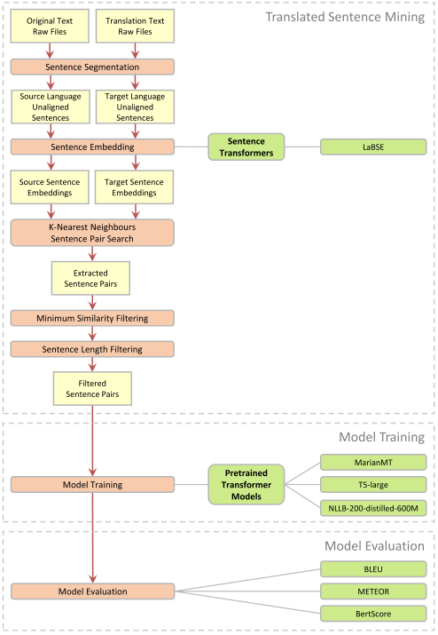

## Transformer Models for Domain-Specific Machine Translation

Example application for the task of fine-tuning pretrained machine translation models on highly domain-specific 
translated sentences. 

For this, likely translation pairs are first extracted from the original versions and the German book translations of the 
_Harry Potter_ fantasy novel series using a _Translated Sentence Mining_ approach. The extracted sentence translations are then used to fine-tune three baseline 
machine translation models (pre-trained model **MarianMT** for translation from English to German, Google's *Text-To-Text Transfer Transformer* **T5** and Meta AI's *No Language Left Behind* machine translation model **NLLB-200** in its distilled 600M variant).

Afterwards, some metrics are calculated to evaluate the performance boost from fine-tuning the models. 

 

### Visualization of the procedure

 

<kbd></kbd>

 

### Overview of the procedure

##### I. Parallel Sentence Extraction (Bitext Mining)

1. Split the unaligned txt files for each book and its translation file into sentences using [Lingtrain Aligners](https://github.com/averkij/lingtrain-aligner) splitter and preprocessor
2. Calculate language-independent sentence level embeddings for the split sentences using GoogleAI's [Language-Agnostic BERT Sentence Embeddings](https://ai.googleblog.com/2020/08/language-agnostic-bert-sentence.html) (LaBSE) in the [Sentence Transformers](https://github.com/UKPLab/sentence-transformers) framework
3. Match the best fitting translation pairs for all sentences using K-Nearest Neighbors search, mostly following Sentence Transformers [example application for Translated Sentence Mining](https://github.com/UKPLab/sentence-transformers/tree/master/examples/applications/parallel-sentence-mining)
4. Filter the sentence pairs by a minimum similarity score
5. Remove sentence pairs containing sentences shorter than 20 or longer than 200 characters 
5. Split the resulting corpus of ~54.000 likely parallel sentences randomly into a train, validation and test set (80%, 10%, 10%)

##### II. Machine Translation Engine Training on Domain-Specific Corpus

1. Load the pre-trained models [`Helsinki-NLP/opus-mt-en-de`](https://github.com/Helsinki-NLP/Opus-MT) (MariantMT), [`t5-large`](https://github.com/google-research/text-to-text-transfer-transformer) (T5) and [`facebook/nllb-200-distilled-600M`](https://arxiv.org/abs/2207.04672) (NLLB-200) in [huggingface](https://huggingface.co/)
2. Fine-tune the models on the extracted parallel sentences using the train and evaluation set for 10 epochs each

##### III. Machine Translation Quality Evaluation

1. Use the non-fine-tuned _MarianMT_, _T5_ and _NLLB-200_ models to get machine translations for a sample from the test set
2. Use the fine-tuned models to get machine translations for a sample from the test set
3. Calculate [BLEU](https://github.com/mjpost/sacrebleu), [METEOR](https://github.com/nltk/nltk/blob/develop/nltk/translate/meteor_score.py) and [BertScore](https://github.com/Tiiiger/bert_score) between references and the target language translations for each the non-fine-tuned and the fine-tuned models

 

### Results

|         Model         | BLEU  | METEOR | BertScore1 |
|:---------------------:|:-----:|:------:|:---------------------:|
|  MarianMT (baseline)  | 0.249 | 0.421  |         0.596         |
| MarianMT (fine-tuned) | 0.379 | 0.541  |         0.709         |
|  T5 (baseline)        | 0.173 | 0.297  |         0.446         |
|  T5 (fine-tuned)      | 0.367 | 0.521  |         0.690         |
|  NLLB-200 (baseline)  | 0.244 | 0.411  |         0.595         |
| NLLB-200 (fine-tuned) | 0.367 | 0.531  |         0.703         |

1: setting the parameter `rescale_with_baseline` to `True`

 

### Requirements

##### - Python >= 3.10

##### - Conda
  - `pytorch==2.3.1`
  - `cudatoolkit=12.1`
  - `pywin32`

##### - pip
  - `transformers`
  - `sentence_transformers`
  - `faiss-gpu`
  - `sacrebleu`
  - `datasets`
  - `bert-score`
  - `lingtrain-aligner`
  - `razdel`
  - `dateparser`
  - `python-dateutil`
  - `numpy`
  - `openpyxl`
  - `sentencepiece`
  - `sacremoses`
  - `nltk`

 

### Notes

All files in this repository which contain text from the books are cut off after the first 50 rows.
The trained model files `model.safetensors` and `optimizer.pt` for each model are omitted in this repository.
